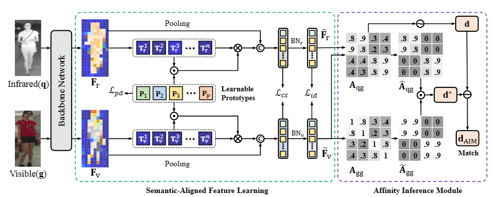

# MyProject
Description
# SAAI


# News

- 2023-8-26: Release codes and our pretrained models at [Baidudisk](https://pan.baidu.com/s/1esd14VJturDXEK0vF2UUnw?pwd=7p3w) (7p3w).

# Getting Started

## Testing

1. Download the dataset and pretrained models (checkpoints) from [Baidudisk](https://pan.baidu.com/s/1esd14VJturDXEK0vF2UUnw?pwd=7p3w) (7p3w), unzip them.
2. Download the training data SYSU, unzip and put it in correct position.
3. Download the [rand_perm_cam.mat](https://github.com/wuancong/SYSU-MM01/tree/master/evaluation/data_split), and put it in correct position.
4. Change the dataset path in the file `configs/default/dataset.py`
5. Run the following command to retrain the model. You need about 22G GPU for the training.

```bash
chmod 755 test.sh
./test
```